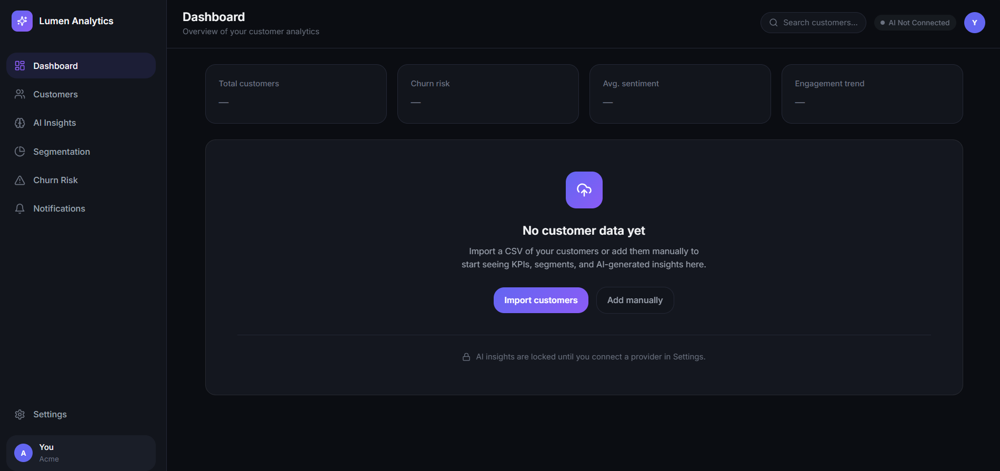

## 📸 Screenshots

### Dashboard Overview
*The main dashboard showing key metrics and the onboarding state for new users.*

---

### Customer Management
*Full customer CRUD interface with search, filtering, and detailed customer profiles.*

![Customers List]/customers-table.png)

---

### Customer Profile
*Detailed customer view with AI-powered insights and activity tracking.*

---

### AI Insights & Q&A
*Ask questions about your customer data in plain language. Powered by your own AI provider.*

---

### Customer Segmentation
*Automatically group customers by behavior, value, and engagement patterns.*

---

### Churn Risk Analysis
*AI-powered churn detection with reasoning for each at-risk customer.*

---

###  Notifications Center
*Stay updated on AI-flagged anomalies and account activity.*

---

###  BYOAI Provider Setup
*Bring Your Own AI (BYOAI) — Connect your own OpenAI, Anthropic, or Gemini API keys. No hidden costs, no vendor lock-in.*

---

---

## ✨ Key Features

###  BYOAI (Bring Your Own AI)
- Connect **OpenAI** (GPT-4, GPT-3.5)
- Connect **Anthropic** (Claude)
- Connect **Azure OpenAI**
- Custom endpoints support
- Encrypted key storage

###  Customer Analytics
- Track **Total Customers**, **Churn Risk**, **Avg. Sentiment**, **Engagement Trend**
- Real-time metrics and visual insights

###  Customer Management
- CSV import with column mapping
- Add, edit, and delete customers
- Advanced search and filtering
- Detailed customer profiles

###  AI-Powered Insights
- Natural language Q&A with your data
- AI-generated customer insights
- Churn risk prediction with reasoning
- Smart customer segmentation

###  Modern UI/UX
- Dark theme with clean typography
- Fully responsive design
- Mobile bottom navigation
- 3-step seamless onboarding
- Toast notifications

###  Security & Privacy
- **Your API keys are encrypted**
- No data stored on our servers
- You control your AI provider and costs
